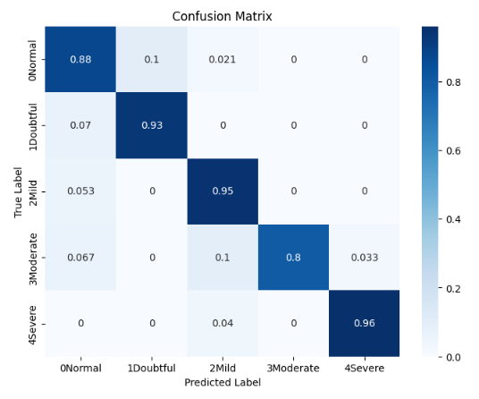

# Knee Osteoarthritis Severity Classification

A deep learning project for classifying knee osteoarthritis (OA) severity from X-ray images using multiple CNN architectures. The project benchmarks four models — DenseNet121, VGG16, VGG19, and EfficientNetB0 — across standard multiclass and ordinal classification approaches.

## Overview

Osteoarthritis is a degenerative joint disease graded using the Kellgren-Lawrence (KL) scale from 0 (Normal) to 4 (Severe). This project trains and evaluates deep learning models to automatically classify knee X-ray images into the following severity grades:
0     | Normal    
1     | Doubtful  
2     | Mild      
3     | Moderate  
4     | Severe    
aiming to assist radiologists with faster and more consistent diagnosis.

## Dataset

Two datasets are used across the notebooks:

**1. Knee Osteoarthritis Dataset with Severity (Kaggle)**
Source: [`shashwatwork/knee-osteoarthritis-dataset-with-severity`](https://www.kaggle.com/datasets/shashwatwork/knee-osteoarthritis-dataset-with-severity)
Pre-split into `train/`, `val/`, and `test/` directories
Used in: `DenseNet.ipynb`, `CNN + VGG16 with data augmentation.ipynb`

**2. Digital Knee X-Ray Images (Mendeley)**
Source: [https://data.mendeley.com/datasets/t9ndx37v5h/1](https://data.mendeley.com/datasets/t9ndx37v5h/1)
Uploaded to Google Drive and mounted in Colab
Used in: `Ordinal Classification VGG19.ipynb`, `EfficientNet.ipynb`

## Project Structure

Osteoarthiritus/
│
├── DenseNet.ipynb                          # DenseNet121 — 5-class & 3-class classification
├── CNN + VGG16 with data augmentation.ipynb # Custom CNN + VGG16 transfer learning
├── Ordinal Classification VGG19.ipynb      # VGG19 with ordinal (CORN) loss
└── EfficientNet.ipynb                      # EfficientNetB0 transfer learning

## Models

### 1. DenseNet121 (`DenseNet.ipynb`)
- Pretrained on ImageNet; fine-tuned with all layers trainable
- Custom head: BatchNormalization → Dense(256) with L2 regularization
- Input size: 224×224
- Evaluated on both 5-class and 3-class (Healthy / Moderate / Severe) setups
- Loss: Categorical Crossentropy | Optimizer: Adam

### 2. VGG16 + Custom CNN (`CNN + VGG16 with data augmentation.ipynb`)
- Pretrained VGG16 backbone (frozen base, custom dense head)
- Feature extraction through Dense(4096) → Dense(4096) → Dense(1024)
- Augmentation via Albumentations: flips, rotations, random crops
- Class balancing through augmentation of minority classes
- Loss: Sparse Categorical Crossentropy | Optimizer: Adam

### 3. VGG19 — Ordinal Classification (`Ordinal Classification VGG19.ipynb`)
- Pretrained VGG19 backbone with fully trainable layers
- Ordinal classification using a **CORN-style loss** (binary cross-entropy on cumulative ordinal labels)
- Input size: 160×640 (full knee X-ray aspect ratio preserved)
- Custom metrics: `accuracy_from_ordinal`, `mae_from_ordinal`
- Data split: 70% train / 20% val / 10% test

### 4. EfficientNetB0 (`EfficientNet.ipynb`)
- Pretrained EfficientNetB0 backbone
- Lightweight head: GlobalAveragePooling2D → Dense(5, softmax)
- Input size: 160×640
- Standard 5-class softmax classification
- Evaluated with confusion matrix and weighted F1 score

## Preprocessing
- Images resized to model-specific input dimensions (224×224 or 160×640)
- Pixel values rescaled to [0, 1] before augmentation
- Train/val/test splits maintained consistently

### Data Augmentation (Albumentations)
Applied to training data to balance class distribution:
- Horizontal & vertical flips
- Rotations (up to 90°)
- Random crops at multiple scales

## Ordinal Classification
The VGG19 notebook implements ordinal regression where labels are encoded as cumulative binary vectors (e.g., grade 3 → `[1, 1, 1, 0]`). This respects the ordered nature of KL grades and penalises predictions proportionally to how far off they are.

## Results

### Ordinal Classification with VGG19
**Confusion Matrix**
